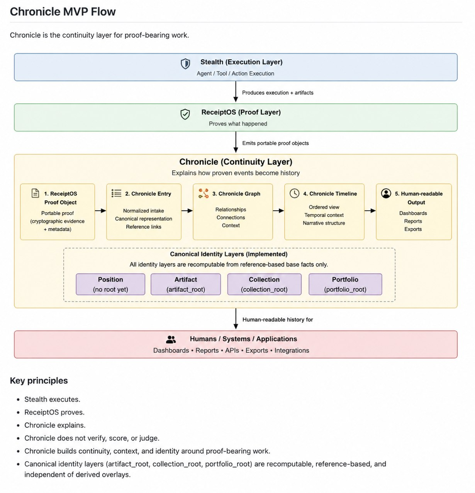

# Chronicle

A research project exploring receipts as a new digital asset class.

## Chronicle MVP Explainer

**Chronicle is a continuity layer for proof-bearing work.**

**ReceiptOS proves what happened.**  
**Chronicle explains how proven events become history.**



MVP flow:

ReceiptOS Proof Object  
→ Chronicle Entry  
→ Chronicle Graph  
→ Chronicle Timeline  
→ Human-readable Output

Chronicle does not replace ReceiptOS verification.
Chronicle does not modify proof objects.
Chronicle does not define ownership, identity, NFT, marketplace, or reputation logic in MVP.

A longer MVP explanation is in `docs/chronicle_mvp_explainer.md`.


Chronicle starts from a simple premise:

- the AI is temporary
- the runtime is temporary
- the platform is temporary
- the verified history survives

The receipt is the durable object.

## What Chronicle is

Chronicle is a first-principles research repository about whether cryptographically verifiable receipts can become a new digital asset class.

It is not centered on speculative scarcity. It is centered on durable, portable, verifiable history.

Chronicle explores how verified work history might become:

- ownable
- composable
- portable across platforms
- valuable over long time horizons
- usable as individual, organizational, and machine history

## What Chronicle is not

Chronicle is:

- **not another NFT project**
- **not another marketplace**
- **not another token**

NFTs may become one transport layer for some use cases, but they are not the core abstraction here.

The core object is the receipt itself:

- portable
- cryptographically verifiable
- long-lived digital history

## Core thesis

If AI systems, runtimes, and companies are transient, then the only durable object may be the verified history of what was done, by whom, under what conditions, with what evidence, and with what outcome.

Chronicle explores whether that verified history can become a durable asset class in its own right.

## Connections

- **ReceiptOS** provides proof packaging, verification, replay-oriented evidence, and proof presentation.
- **CYPHES** provides work, workflow meaning, and settlement.
- **Chronicle** explores ownership, composition, transfer, and long-term value of the resulting receipts.

## Repository structure

- `docs/VISION.md`
- `docs/PHILOSOPHY.md`
- `docs/RECEIPTS_AS_ASSETS.md`
- `docs/CHRONICLE_MODEL.md`
- `docs/OWNERSHIP.md`
- `docs/COMPOSITION.md`
- `docs/TOKENIZATION.md`
- `docs/OPEN_QUESTIONS.md`
- `docs/NON_GOALS.md`
- `docs/chronicle_mvp_v0.md`
- `docs/chronicle_first_build_plan_v0.md`
- `docs/chronicle_mvp_explainer.md`
- `docs/chronicle_position_v0.md`
- `docs/chronicle_asset_model_v0.md`
- `docs/chronicle_mvp_e2e_demo.md`
- `docs/images/chronicle-mvp-flow.png`
- `examples/chronicle-example.json`
- `examples/receipt-example.json`
- `examples/chronicle-mvp-example.json`
- `examples/chronicle-mvp-generated-timeline.json`
- `src/chronicle_mvp_data_model.ts`
- `src/chronicle_mvp_timeline_generator.ts`
- `src/chronicle_mvp_timeline_generator_core.mjs`
- `scripts/validate_chronicle_mvp_timeline.mjs`
- `scripts/run_chronicle_mvp_demo.mjs`
- `scripts/run_chronicle_node.mjs`

## Chronicle MVP End-to-End Flow

ReceiptOS Proof Object  
→ Chronicle Entry  
→ Chronicle Graph  
→ Chronicle Timeline  
→ Human-readable Output

The current Chronicle MVP can now be demonstrated end to end using:

- `examples/chronicle-mvp-example.json`
- `examples/chronicle-mvp-generated-timeline.json`
- `src/chronicle_mvp_timeline_generator.ts`
- `scripts/validate_chronicle_mvp_timeline.mjs`
- `scripts/run_chronicle_mvp_demo.mjs`
- `docs/chronicle_mvp_e2e_demo.md`

The MVP example currently models a realistic software project flow:

- implementation completed
- verification completed
- release created

Each stage becomes a Chronicle Entry.
Relationships become Chronicle Graph edges.
The generated Timeline then becomes both machine-readable output and a simple human-readable historical view.

## Run the MVP demo

```bash
node scripts/run_chronicle_mvp_demo.mjs
```

Expected output includes:

- proof object refs
- entries
- graph edges
- timeline events
- final markdown/history view

## Run Chronicle local node

### 1. Start local node

```powershell
cd C:\Users\msi\dev\Chronicle
node scripts\run_chronicle_node.mjs
```

The local node now persists entries to:

`data/chronicle-local-store.json`

### 2. Health check

```powershell
Invoke-RestMethod http://localhost:8080/health
```

### 3. POST a manual Chronicle entry

```powershell
$entry = @{
  entry_id = "entry-manual-001"
  proof_object_refs = @(
    @{
      proof_object_id = "proofobj-receiptos-manual-001"
      proof_system = "ReceiptOS"
      receipt_root = "0xproofroot-manual-001"
      proof_ref = "receiptos://proof/manual/001"
      replay_ref = "receiptos://replay/manual/001"
      anchor_ref = "receiptos://anchor/manual/001"
    }
  )
  project_refs = @("project-chronicle-core")
  relation_type = "created"
  chronology_position = "1"
  created_at = "2026-06-27T14:00:00Z"
  metadata = @{
    label = "Manual Chronicle entry"
  }
} | ConvertTo-Json -Depth 10

Invoke-RestMethod -Method Post `
  -Uri http://localhost:8080/entries `
  -ContentType 'application/json' `
  -Body $entry
```

### 4. Check stored entries

```powershell
Invoke-RestMethod http://localhost:8080/entries
```

## Import ReceiptOS Proof

POST `/import/receipt`

Example request:

```powershell
$proof = Get-Content .\examples\receipt-import-example.json -Raw

Invoke-RestMethod -Method Post `
  -Uri http://localhost:8080/import/receipt `
  -ContentType 'application/json' `
  -Body $proof
```

Expected result:

- a Chronicle Entry is created automatically
- the imported proof becomes visible in `/entries`
- the imported proof appears in `/timeline`
- the imported proof appears in `/chronicle.md`
- the imported proof appears in `/view`

Re-importing the same ReceiptOS proof object is idempotent.

## Import Receipt Timeline

Example PowerShell command:

```powershell
$capsule = Get-Content .\examples\receipt-timeline-import-example.json -Raw

Invoke-RestMethod -Method Post `
  -Uri http://localhost:8080/import/receipt-timeline `
  -ContentType 'application/json' `
  -Body $capsule
```

This imports multiple timeline events from one ReceiptOS-style capsule, creates one Chronicle Entry per event, preserves the shared proof reference, and makes the result visible in `/entries`, `/timeline`, `/chronicle.md`, `/view`, and `/project/:project_ref/view`.

Re-importing the same timeline capsule is idempotent for already imported event IDs.

### 5. Generate timeline

```powershell
Invoke-RestMethod http://localhost:8080/timeline
```

### 6. Generate Markdown history

```powershell
Invoke-RestMethod http://localhost:8080/chronicle.md
```

## View Chronicle in browser

Start node:

```powershell
node scripts\run_chronicle_node.mjs
```

Open:

`http://localhost:8080/view`

## View project history

Example:

`http://localhost:8080/project/project-chronicle-core/view`

## View release history

Example:

`http://localhost:8080/release/v0.1.0/view`

## View profile history

Example:

`http://localhost:8080/profile/agent-chronicle-builder/view`

## View Chronicle Positions

Example:

`http://localhost:8080/position/position-chronicle-core-v0.1.0/view`

Position scorecard examples:

- `http://localhost:8080/position/position-chronicle-core-v0.1.0/scorecard`
- `http://localhost:8080/position/position-chronicle-core-v0.1.0/scorecard/view`

Position evolution examples:

- `http://localhost:8080/position/position-chronicle-core-v0.1.0/evolution`
- `http://localhost:8080/position/position-chronicle-core-v0.1.0/evolution/view`

## Export Chronicle Bundle

- `GET http://localhost:8080/export`
- `GET http://localhost:8080/project/project-chronicle-core/export`

## Import Chronicle Bundle

```powershell
$bundle = Invoke-RestMethod http://localhost:8080/export | ConvertTo-Json -Depth 20

Invoke-RestMethod -Method Post `
  -Uri http://localhost:8080/import/bundle `
  -ContentType 'application/json' `
  -Body $bundle
```

The local node now uses file-backed local storage in `data/chronicle-local-store.json`.

Delete `data/chronicle-local-store.json` to clear local state.

## MVP flow

The first Chronicle implementation target is intentionally small:

ReceiptOS Proof Object  
→ Chronicle Entry  
→ Chronicle Graph  
→ Chronicle Timeline

The repository now includes a minimal implementation-neutral MVP data model in `src/chronicle_mvp_data_model.ts`, a timeline generator in `src/chronicle_mvp_timeline_generator.ts`, a runtime generator core in `src/chronicle_mvp_timeline_generator_core.mjs`, a matching example fixture in `examples/chronicle-mvp-example.json`, and a generated timeline example in `examples/chronicle-mvp-generated-timeline.json`.

This MVP flow is intended to prove only that Chronicle can:

- ingest a ReceiptOS Proof Object reference
- create Chronicle Entries
- link Entries with Chronicle Graph edges
- project ordered continuity as a Chronicle Timeline generated from Chronicle Entries and Chronicle Graph edges

It is explicitly not yet implementing Profile, Portfolio, Release View, ownership, NFT, marketplace, or reputation logic.

## Scope

This repository is about:

- first principles
- systems design
- architectural models
- ownership models
- lifecycle models
- composition models
- tokenization boundary analysis

This repository is not about:

- smart contracts
- token implementation
- selecting a blockchain
- building a marketplace first

Chronicle exists to define the conceptual substrate before any transport or monetization layer hardens into the wrong abstraction.

## CI

Chronicle runs the MVP demo in GitHub Actions on pull requests and pushes to main.

## License

- Code and documentation: Apache-2.0
- Chronicle objects and user-generated histories: owned by their creators or lawful owners
- Brand and trademark rights: reserved
- See `docs/LICENSE_POLICY_V0.md`
