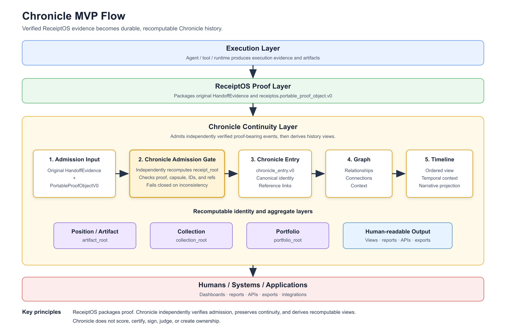

# Chronicle

A research project exploring receipts as a new digital asset class.

## Chronicle MVP Explainer

**Chronicle is a continuity layer for proof-bearing work.**

**ReceiptOS proves what happened.**  
**Chronicle explains how proven events become history.**



MVP flow:

ReceiptOS Proof Object  
→ Chronicle Entry  
→ Chronicle Graph  
→ Chronicle Timeline  
→ Human-readable Output

Chronicle does not replace ReceiptOS verification.
Chronicle does not modify proof objects.
Chronicle does not define ownership, identity, NFT, marketplace, or reputation logic in MVP.

Post-quantum considerations for receipt longevity: see [pq-receipt-profile](https://github.com/pipavlo82/pq-receipt-profile).

Core formulations: see [Canonical Principles](docs/CANONICAL_PRINCIPLES.md).

A longer MVP explanation is in `docs/chronicle_mvp_explainer.md`.

Chronicle follows a simple rule: history should begin only after correctness has survived independent verification. Without the proof step, history becomes a story someone tells about what happened, not a fact others can re-derive. See: [Verification Before History](docs/verification-before-history.md).


Chronicle starts from a simple premise:

- the AI is temporary
- the runtime is temporary
- the platform is temporary
- the verified history survives

The receipt is the durable object.

## What Chronicle is

Chronicle is a first-principles research repository about whether cryptographically verifiable receipts can become a new digital asset class.

It is not centered on speculative scarcity. It is centered on durable, portable, verifiable history.

Chronicle explores how verified work history might become:

- ownable
- composable
- portable across platforms
- valuable over long time horizons
- usable as individual, organizational, and machine history

## What Chronicle is not

Chronicle is:

- **not another NFT project**
- **not another marketplace**
- **not another token**

NFTs may become one transport layer for some use cases, but they are not the core abstraction here.

The core object is the receipt itself:

- portable
- cryptographically verifiable
- long-lived digital history

## Core thesis

If AI systems, runtimes, and companies are transient, then the only durable object may be the verified history of what was done, by whom, under what conditions, with what evidence, and with what outcome.

Chronicle explores whether that verified history can become a durable asset class in its own right.

## Connections

- **ReceiptOS** provides proof packaging, verification, replay-oriented evidence, and proof presentation.
- **CYPHES** provides work, workflow meaning, and settlement.
- **Chronicle** explores ownership, composition, transfer, and long-term value of the resulting receipts.

## Repository structure

The active implementation is organized around these areas:

- `specs/` — canonical Entry, Graph, Timeline, Profile, Release View, and Portfolio v0 boundaries
- `src/chronicle_receiptos_admission.mjs` — independently verifies ReceiptOS evidence before creating an Entry
- `src/chronicle_receiptos_root.mjs` — ReceiptOS receipt-root recomputation
- `src/chronicle_entry.mjs` and `src/chronicle_entry_identity.mjs` — Entry schema version and identity-conflict classification
- `src/chronicle_position_artifact.mjs`, `src/chronicle_collection.mjs`, and `src/chronicle_portfolio.mjs` — portable history aggregates and deterministic roots
- `src/chronicle_mvp_timeline_generator_core.mjs` — timeline projection
- `scripts/run_chronicle_node.mjs` — local HTTP node and views
- `scripts/create-chronicle-entry.mjs` — admitted ReceiptOS Entry creation
- `scripts/create-chronicle-portfolio.mjs` and `scripts/verify-chronicle-portfolio.mjs` — portable portfolio tooling
- `tests/` — admission, ingress, identity, root, aggregate, route, and golden-vector coverage
- `examples/` — MVP, portable proof-object, Entry, and Portfolio examples
- `docs/` — architecture, principles, research, and end-to-end explanations

## Chronicle MVP End-to-End Flow

ReceiptOS Proof Object  
→ Chronicle Entry  
→ Chronicle Graph  
→ Chronicle Timeline  
→ Human-readable Output

The current Chronicle MVP can now be demonstrated end to end using:

- `examples/chronicle-mvp-example.json`
- `examples/chronicle-mvp-generated-timeline.json`
- `src/chronicle_mvp_timeline_generator.ts`
- `scripts/validate_chronicle_mvp_timeline.mjs`
- `scripts/run_chronicle_mvp_demo.mjs`
- `docs/chronicle_mvp_e2e_demo.md`

The MVP example currently models a realistic software project flow:

- implementation completed
- verification completed
- release created

Each stage becomes a Chronicle Entry.
Relationships become Chronicle Graph edges.
The generated Timeline then becomes both machine-readable output and a simple human-readable historical view.

## Run the MVP demo

```bash
node scripts/run_chronicle_mvp_demo.mjs
```

Expected output includes:

- proof object refs
- entries
- graph edges
- timeline events
- final markdown/history view

## Run Chronicle local node

### 1. Start local node

```powershell
cd C:\Users\msi\dev\Chronicle
node scripts\run_chronicle_node.mjs
```

The local node now persists entries to:

`data/chronicle-local-store.json`

### 2. Health check

```powershell
Invoke-RestMethod http://localhost:8080/health
```

### 3. POST a manual Chronicle entry

Compatibility-only legacy model example:

- direct `POST /entries` remains available for non-ReceiptOS legacy entries;
- ReceiptOS-backed Entries are rejected on this route, including canonical-looking or disguised legacy payloads;
- import ReceiptOS material through `POST /import/receipt`, which requires original evidence and independently recomputes the receipt root;
- see `specs/chronicle_entry_v0.md` for the canonical v0 boundary.

```powershell
$entry = @{
  entry_id = "entry-manual-001"
  proof_object_refs = @(
    @{
      proof_object_id = "proofobj-receiptos-manual-001"
      proof_system = "ExampleProofSystem"
      receipt_root = "0xproofroot-manual-001"
      proof_ref = "receiptos://proof/manual/001"
      replay_ref = "receiptos://replay/manual/001"
      anchor_ref = "receiptos://anchor/manual/001"
    }
  )
  project_refs = @("project-chronicle-core")
  relation_type = "created"
  chronology_position = "1"
  created_at = "2026-06-27T14:00:00Z"
  metadata = @{
    label = "Manual Chronicle entry"
  }
} | ConvertTo-Json -Depth 10

Invoke-RestMethod -Method Post `
  -Uri http://localhost:8080/entries `
  -ContentType 'application/json' `
  -Body $entry
```

### 4. Check stored entries

```powershell
Invoke-RestMethod http://localhost:8080/entries
```

## Import ReceiptOS Proof

POST `/import/receipt`

ReceiptOS admission requires both the original HandoffEvidence and its `receiptos.portable_proof_object.v0`. A proof object alone is unverifiable and is rejected.

Example request using the tracked conformance fixtures:

```powershell
$evidence = Get-Content .\tests\fixtures\receiptos\session-evidence.sample.json -Raw | ConvertFrom-Json
$proofObject = Get-Content .\tests\fixtures\receiptos\portable-proof-object.sample.json -Raw | ConvertFrom-Json
$payload = @{ evidence = $evidence; proof_object = $proofObject } | ConvertTo-Json -Depth 100

Invoke-RestMethod -Method Post `
  -Uri http://localhost:8080/import/receipt `
  -ContentType 'application/json' `
  -Body $payload
```

The admission gate independently recomputes the receipt root and checks the proof object's root, embedded capsule, verifier result, canonical `proof_object_id`, and canonical `proof_ref` before creating a `chronicle_entry.v0`.

- first admission: `201`
- identical canonical re-import: `200`, without a duplicate
- same identity with different canonical content: `409`
- malformed input: `400`
- evidence or proof inconsistency: `422`

Accepted Entries appear in `/entries`, `/timeline`, `/chronicle.md`, and `/view`. Conflicting content is never overwritten or silently deduplicated. Normative identity behavior is defined in `specs/chronicle_entry_v0.md`.

## Import Receipt Timeline

`POST /import/receipt-timeline` is retained as a legacy endpoint but fails closed for ReceiptOS timeline capsules. That payload shape contains no original evidence, so Chronicle cannot independently recompute the receipt root.

Import each event's underlying evidence and portable proof object through `POST /import/receipt` instead. The legacy endpoint returns `400` and does not write any Entry.

### 5. Generate timeline

```powershell
Invoke-RestMethod http://localhost:8080/timeline
```

### 6. Generate Markdown history

```powershell
Invoke-RestMethod http://localhost:8080/chronicle.md
```

## View Chronicle in browser

Start node:

```powershell
node scripts\run_chronicle_node.mjs
```

Open:

`http://localhost:8080/view`

## View project history

Example:

`http://localhost:8080/project/project-chronicle-core/view`

## View release history

Example:

`http://localhost:8080/release/v0.1.0/view`

## View profile history

Example:

`http://localhost:8080/profile/agent-chronicle-builder/view`

## View Chronicle Positions

Example:

`http://localhost:8080/position/position-chronicle-core-v0.1.0/view`

Position scorecard examples:

- `http://localhost:8080/position/position-chronicle-core-v0.1.0/scorecard`
- `http://localhost:8080/position/position-chronicle-core-v0.1.0/scorecard/view`

Position evolution examples:

- `http://localhost:8080/position/position-chronicle-core-v0.1.0/evolution`
- `http://localhost:8080/position/position-chronicle-core-v0.1.0/evolution/view`

Position snapshot example:

- `http://localhost:8080/position/position-chronicle-core-v0.1.0/snapshot`

Position artifact examples:

- `http://localhost:8080/position/position-chronicle-core-v0.1.0/artifact`
- `http://localhost:8080/position/position-chronicle-core-v0.1.0/artifact/view`

Artifact root defines identity of the accumulated scoped history.
Derived overlays such as scorecard, evolution, snapshot, and lineage are recomputable views and are excluded from artifact identity.
Chronicle recomputes local history views; it does not certify or score.

Position lineage examples:

- `http://localhost:8080/position/position-chronicle-core-v0.1.0/lineage`
- `http://localhost:8080/position/position-chronicle-core-v0.1.0/lineage/view`

Artifact Collection examples:

- `http://localhost:8080/collections`
- `http://localhost:8080/collection/project-chronicle-core`
- `http://localhost:8080/collection/project-chronicle-core/export`
- `http://localhost:8080/collection/project-chronicle-core/view`

Chronicle Portfolio examples:

- `http://localhost:8080/portfolios`
- `http://localhost:8080/portfolio/position-chronicle-core-v0.1.0`
- `http://localhost:8080/portfolio/position-chronicle-core-v0.1.0/export`
- `http://localhost:8080/portfolio/position-chronicle-core-v0.1.0/view`

Receipt → `receipt_root`. Artifact → `artifact_root`. Collection → `collection_root`. Portfolio → `portfolio_root`.
Portfolio recomputes a portable body of Chronicle history. It does not score, certify, verify, sign, or create ownership.

## View ReceiptOS receipts

Examples:

- `http://localhost:8080/receipts`
- `http://localhost:8080/receipt/proofobj-receiptos-timeline-001`
- `http://localhost:8080/receipt/proofobj-receiptos-timeline-001/view`

## Export Chronicle Bundle

- `GET http://localhost:8080/export`
- `GET http://localhost:8080/project/project-chronicle-core/export`

## Import Chronicle Bundle

```powershell
$bundle = Invoke-RestMethod http://localhost:8080/export | ConvertTo-Json -Depth 20

Invoke-RestMethod -Method Post `
  -Uri http://localhost:8080/import/bundle `
  -ContentType 'application/json' `
  -Body $bundle
```

Bundle import is supported only when every member is non-ReceiptOS-backed. Because a bundle carries no original evidence, a bundle containing any ReceiptOS-backed Entry is rejected atomically. Import those Entries individually through `POST /import/receipt`. Canonically identical non-ReceiptOS duplicates are idempotent; an identity conflict rejects the whole bundle without partial writes.

The local node now uses file-backed local storage in `data/chronicle-local-store.json`.

Delete `data/chronicle-local-store.json` to clear local state.

## MVP flow

The first Chronicle implementation target is intentionally small:

ReceiptOS Proof Object  
→ Chronicle Entry  
→ Chronicle Graph  
→ Chronicle Timeline

The repository now includes a minimal implementation-neutral MVP data model in `src/chronicle_mvp_data_model.ts`, a timeline generator in `src/chronicle_mvp_timeline_generator.ts`, a runtime generator core in `src/chronicle_mvp_timeline_generator_core.mjs`, a matching example fixture in `examples/chronicle-mvp-example.json`, and a generated timeline example in `examples/chronicle-mvp-generated-timeline.json`.

This MVP flow is intended to prove only that Chronicle can:

- ingest a ReceiptOS Proof Object reference
- create Chronicle Entries
- link Entries with Chronicle Graph edges
- project ordered continuity as a Chronicle Timeline generated from Chronicle Entries and Chronicle Graph edges

The local node now implements derived Project, Release, Profile, Position, Artifact, Collection, and Portfolio views. These are recomputable continuity views and deterministic reference-set aggregates; Chronicle still does not certify, score, sign, create ownership, or implement NFT, marketplace, or reputation logic.

## Scope

This repository is about:

- first principles
- systems design
- architectural models
- ownership models
- lifecycle models
- composition models
- tokenization boundary analysis

This repository is not about:

- smart contracts
- token implementation
- selecting a blockchain
- building a marketplace first

Chronicle exists to define the conceptual substrate before any transport or monetization layer hardens into the wrong abstraction.

## Tests and CI

Run the complete Node test suite locally:

```bash
node --test tests/*.test.mjs
```

The suite covers ReceiptOS admission and ingress hardening, identity conflicts, receipt-root parity, deterministic Artifact/Collection/Portfolio roots, route wiring, and golden vectors.

GitHub Actions runs the MVP demo on pull requests and pushes to `main`. The workflow's package test step runs only when a `package.json` test script exists; this repository currently has no `package.json`, so use the command above for the complete test suite.

## License

- Code and documentation: Apache-2.0
- Chronicle objects and user-generated histories: owned by their creators or lawful owners
- Brand and trademark rights: reserved
- See `docs/LICENSE_POLICY_V0.md`
